# WorkDo HRM - Workflow Diagrams

This document contains Mermaid diagrams for all major workflows and processes in the WorkDo HRM system.

---

## Table of Contents
1. [System Architecture](#1-system-architecture)
2. [Authentication Flow](#2-authentication-flow)
3. [Role-Based Access Control (RBAC)](#3-role-based-access-control-rbac)
4. [Employee Lifecycle](#4-employee-lifecycle)
5. [Leave Management Workflow](#5-leave-management-workflow)
6. [Attendance Workflow](#6-attendance-workflow)
7. [Payroll Processing Workflow](#7-payroll-processing-workflow)
8. [Recruitment Pipeline](#8-recruitment-pipeline)
9. [Performance Review Workflow](#9-performance-review-workflow)
10. [Contract Management Workflow](#10-contract-management-workflow)
11. [Document Acknowledgment Workflow](#11-document-acknowledgment-workflow)
12. [Meeting Management Workflow](#12-meeting-management-workflow)
13. [Training Management Workflow](#13-training-management-workflow)
14. [Asset Management Workflow](#14-asset-management-workflow)
15. [Complaint Resolution Workflow](#15-complaint-resolution-workflow)
16. [Transfer Workflow](#16-transfer-workflow)
17. [Promotion Workflow](#17-promotion-workflow)
18. [Trip Approval Workflow](#18-trip-approval-workflow)

---

## 1. System Architecture

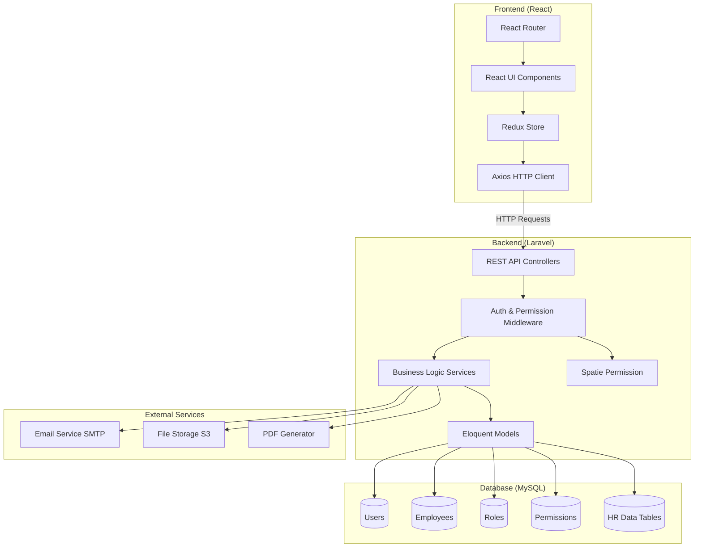
```mermaid
graph TB
    subgraph "Frontend (React)"
        UI[React UI Components]
        Redux[Redux Store]
        Router[React Router]
        Axios[Axios HTTP Client]
    end

    subgraph "Backend (Laravel)"
        API[REST API Controllers]
        Middleware[Auth & Permission Middleware]
        Services[Business Logic Services]
        Models[Eloquent Models]
        Spatie[Spatie Permission]
    end

    subgraph "Database (MySQL)"
        Users[(Users)]
        Employees[(Employees)]
        Roles[(Roles)]
        Permissions[(Permissions)]
        HRData[(HR Data Tables)]
    end

    subgraph "External Services"
        Email[Email Service SMTP]
        Storage[File Storage S3]
        PDF[PDF Generator]
    end

    UI --> Redux
    Redux --> Axios
    Axios -->|HTTP Requests| API
    Router --> UI

    API --> Middleware
    Middleware --> Spatie
    Middleware --> Services
    Services --> Models
    Models --> Users
    Models --> Employees
    Models --> Roles
    Models --> Permissions
    Models --> HRData

    Services --> Email
    Services --> Storage
    Services --> PDF
```

---

## 2. Authentication Flow

### 2.1 Login Flow

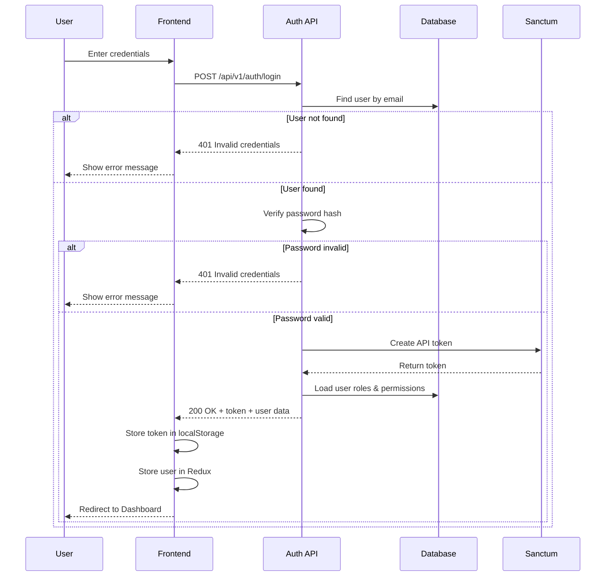
```mermaid
sequenceDiagram
    participant U as User
    participant F as Frontend
    participant A as Auth API
    participant DB as Database
    participant S as Sanctum

    U->>F: Enter credentials
    F->>A: POST /api/v1/auth/login
    A->>DB: Find user by email
    
    alt User not found
        A-->>F: 401 Invalid credentials
        F-->>U: Show error message
    else User found
        A->>A: Verify password hash
        alt Password invalid
            A-->>F: 401 Invalid credentials
            F-->>U: Show error message
        else Password valid
            A->>S: Create API token
            S-->>A: Return token
            A->>DB: Load user roles & permissions
            A-->>F: 200 OK + token + user data
            F->>F: Store token in localStorage
            F->>F: Store user in Redux
            F-->>U: Redirect to Dashboard
        end
    end
```

### 2.2 Password Reset Flow

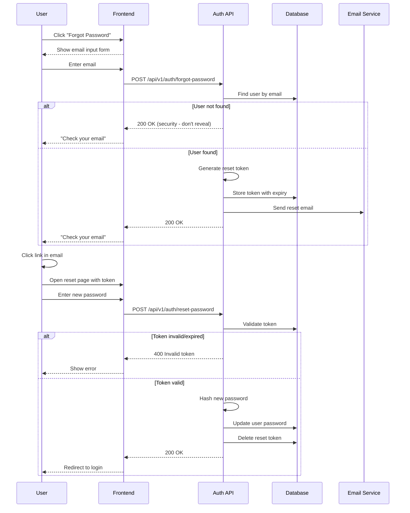
```mermaid
sequenceDiagram
    participant U as User
    participant F as Frontend
    participant A as Auth API
    participant DB as Database
    participant E as Email Service

    U->>F: Click "Forgot Password"
    F-->>U: Show email input form
    U->>F: Enter email
    F->>A: POST /api/v1/auth/forgot-password
    A->>DB: Find user by email
    
    alt User not found
        A-->>F: 200 OK (security - don't reveal)
        F-->>U: "Check your email"
    else User found
        A->>A: Generate reset token
        A->>DB: Store token with expiry
        A->>E: Send reset email
        A-->>F: 200 OK
        F-->>U: "Check your email"
    end

    U->>U: Click link in email
    U->>F: Open reset page with token
    U->>F: Enter new password
    F->>A: POST /api/v1/auth/reset-password
    A->>DB: Validate token
    
    alt Token invalid/expired
        A-->>F: 400 Invalid token
        F-->>U: Show error
    else Token valid
        A->>A: Hash new password
        A->>DB: Update user password
        A->>DB: Delete reset token
        A-->>F: 200 OK
        F-->>U: Redirect to login
    end
```

### 2.3 Token Refresh Flow

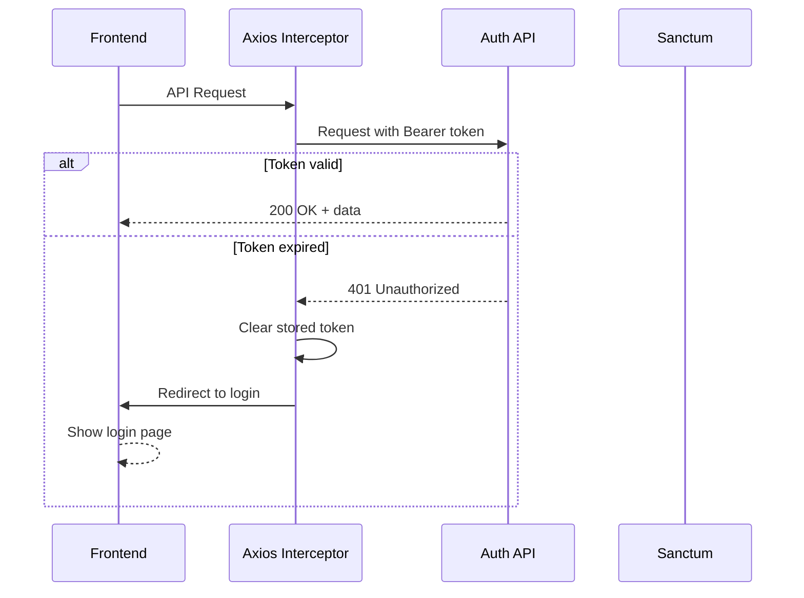
```mermaid
sequenceDiagram
    participant F as Frontend
    participant I as Axios Interceptor
    participant A as Auth API
    participant S as Sanctum

    F->>I: API Request
    I->>A: Request with Bearer token
    
    alt Token valid
        A-->>F: 200 OK + data
    else Token expired
        A-->>I: 401 Unauthorized
        I->>I: Clear stored token
        I->>F: Redirect to login
        F-->>F: Show login page
    end
```

---

## 3. Role-Based Access Control (RBAC)

### 3.1 Permission Check Flow

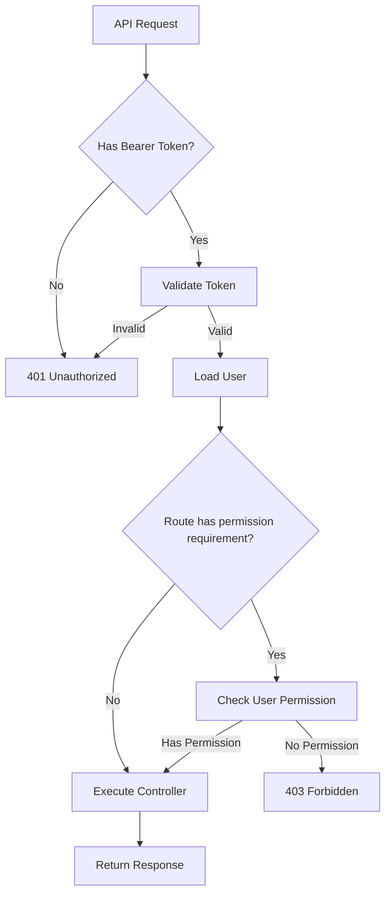
```mermaid
flowchart TD
    A[API Request] --> B{Has Bearer Token?}
    B -->|No| C[401 Unauthorized]
    B -->|Yes| D[Validate Token]
    D -->|Invalid| C
    D -->|Valid| E[Load User]
    E --> F{Route has permission requirement?}
    F -->|No| G[Execute Controller]
    F -->|Yes| H[Check User Permission]
    H -->|Has Permission| G
    H -->|No Permission| I[403 Forbidden]
    G --> J[Return Response]
```

### 3.2 Role Hierarchy

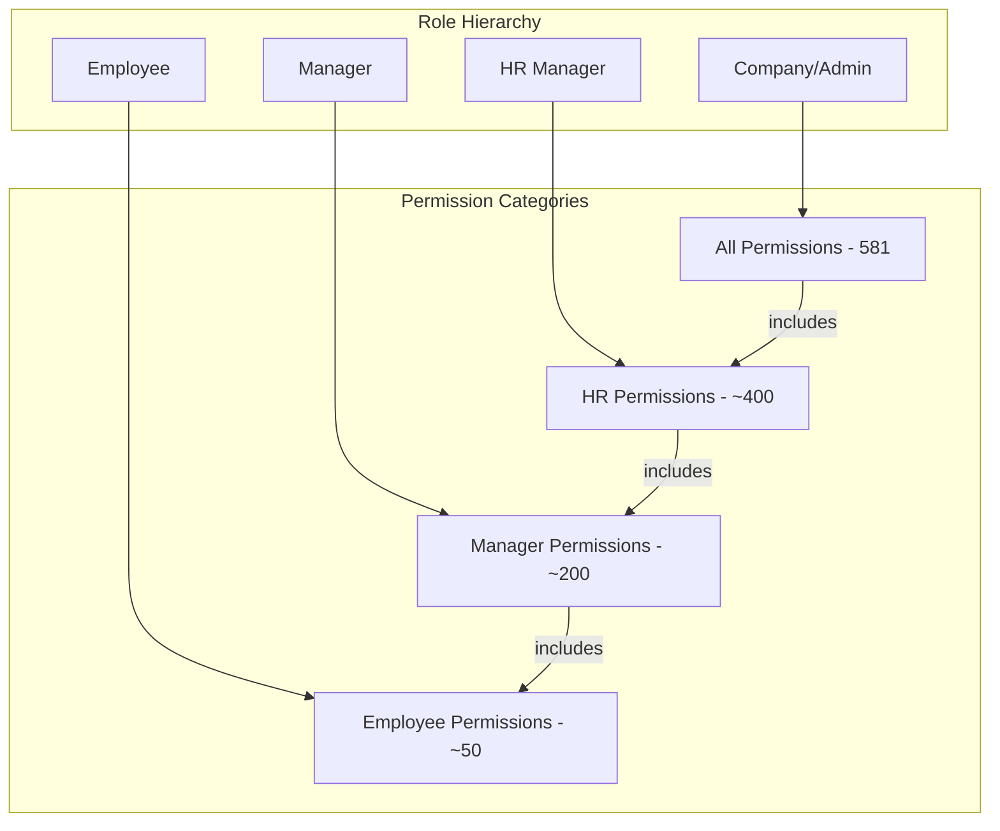
```mermaid
graph TD
    subgraph "Role Hierarchy"
        Company[Company/Admin]
        HR[HR Manager]
        Manager[Manager]
        Employee[Employee]
    end

    subgraph "Permission Categories"
        All[All Permissions - 581]
        HRPerms[HR Permissions - ~400]
        MgrPerms[Manager Permissions - ~200]
        EmpPerms[Employee Permissions - ~50]
    end

    Company --> All
    HR --> HRPerms
    Manager --> MgrPerms
    Employee --> EmpPerms

    All -->|includes| HRPerms
    HRPerms -->|includes| MgrPerms
    MgrPerms -->|includes| EmpPerms
```

### 3.3 Permission Assignment Flow

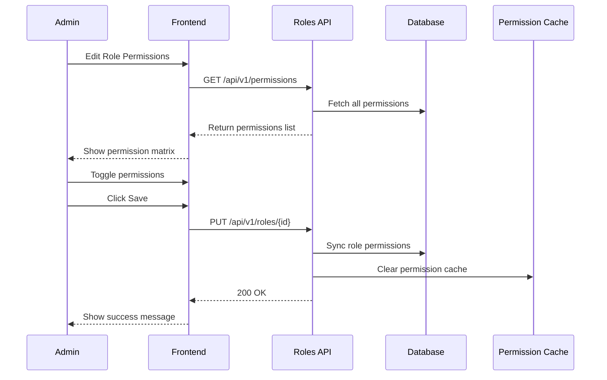
```mermaid
sequenceDiagram
    participant A as Admin
    participant F as Frontend
    participant API as Roles API
    participant DB as Database
    participant Cache as Permission Cache

    A->>F: Edit Role Permissions
    F->>API: GET /api/v1/permissions
    API->>DB: Fetch all permissions
    API-->>F: Return permissions list
    F-->>A: Show permission matrix

    A->>F: Toggle permissions
    A->>F: Click Save
    F->>API: PUT /api/v1/roles/{id}
    API->>DB: Sync role permissions
    API->>Cache: Clear permission cache
    API-->>F: 200 OK
    F-->>A: Show success message
```

---

## 4. Employee Lifecycle

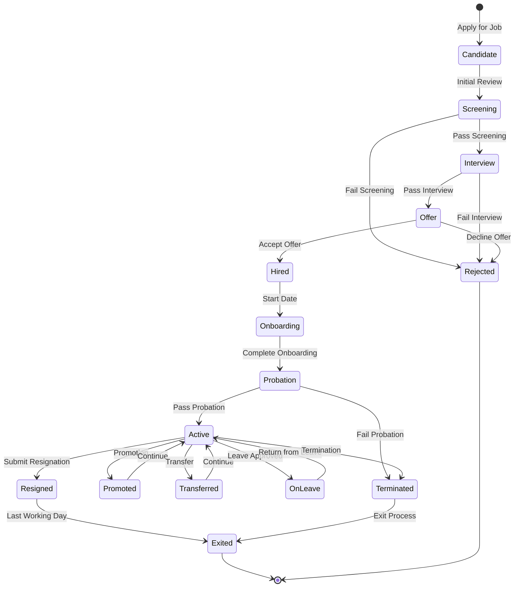
```mermaid
stateDiagram-v2
    [*] --> Candidate: Apply for Job
    Candidate --> Screening: Initial Review
    Screening --> Interview: Pass Screening
    Screening --> Rejected: Fail Screening
    Interview --> Offer: Pass Interview
    Interview --> Rejected: Fail Interview
    Offer --> Hired: Accept Offer
    Offer --> Rejected: Decline Offer
    Hired --> Onboarding: Start Date
    Onboarding --> Probation: Complete Onboarding
    Probation --> Active: Pass Probation
    Probation --> Terminated: Fail Probation
    Active --> Promoted: Promotion
    Promoted --> Active: Continue
    Active --> Transferred: Transfer
    Transferred --> Active: Continue
    Active --> OnLeave: Leave Approved
    OnLeave --> Active: Return from Leave
    Active --> Resigned: Submit Resignation
    Resigned --> Exited: Last Working Day
    Active --> Terminated: Termination
    Terminated --> Exited: Exit Process
    Exited --> [*]
    Rejected --> [*]
```

---

## 5. Leave Management Workflow

### 5.1 Leave Application Flow

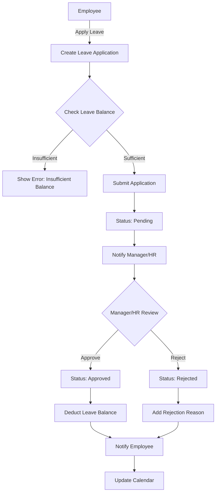
```mermaid
flowchart TD
    A[Employee] -->|Apply Leave| B[Create Leave Application]
    B --> C{Check Leave Balance}
    C -->|Insufficient| D[Show Error: Insufficient Balance]
    C -->|Sufficient| E[Submit Application]
    E --> F[Status: Pending]
    F --> G[Notify Manager/HR]
    G --> H{Manager/HR Review}
    H -->|Approve| I[Status: Approved]
    H -->|Reject| J[Status: Rejected]
    I --> K[Deduct Leave Balance]
    K --> L[Notify Employee]
    J --> M[Add Rejection Reason]
    M --> L
    L --> N[Update Calendar]
```

### 5.2 Leave Approval Sequence

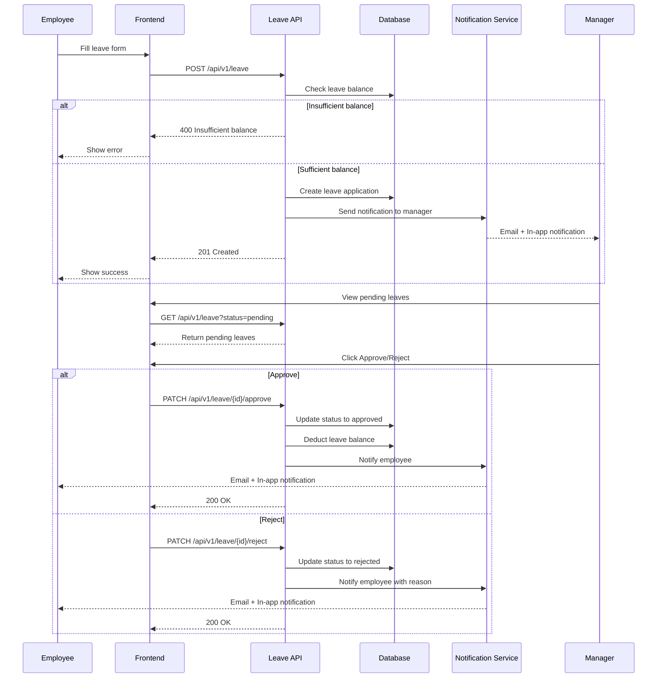
```mermaid
sequenceDiagram
    participant E as Employee
    participant F as Frontend
    participant API as Leave API
    participant DB as Database
    participant N as Notification Service
    participant M as Manager

    E->>F: Fill leave form
    F->>API: POST /api/v1/leave
    API->>DB: Check leave balance
    
    alt Insufficient balance
        API-->>F: 400 Insufficient balance
        F-->>E: Show error
    else Sufficient balance
        API->>DB: Create leave application
        API->>N: Send notification to manager
        N-->>M: Email + In-app notification
        API-->>F: 201 Created
        F-->>E: Show success
    end

    M->>F: View pending leaves
    F->>API: GET /api/v1/leave?status=pending
    API-->>F: Return pending leaves
    M->>F: Click Approve/Reject

    alt Approve
        F->>API: PATCH /api/v1/leave/{id}/approve
        API->>DB: Update status to approved
        API->>DB: Deduct leave balance
        API->>N: Notify employee
        N-->>E: Email + In-app notification
        API-->>F: 200 OK
    else Reject
        F->>API: PATCH /api/v1/leave/{id}/reject
        API->>DB: Update status to rejected
        API->>N: Notify employee with reason
        N-->>E: Email + In-app notification
        API-->>F: 200 OK
    end
```

### 5.3 Leave Balance Calculation

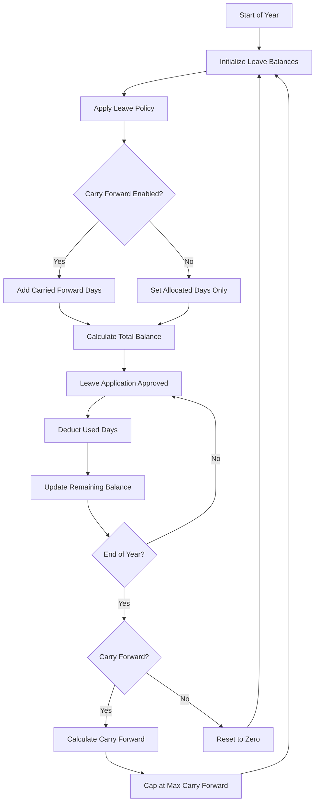
```mermaid
flowchart TD
    A[Start of Year] --> B[Initialize Leave Balances]
    B --> C[Apply Leave Policy]
    C --> D{Carry Forward Enabled?}
    D -->|Yes| E[Add Carried Forward Days]
    D -->|No| F[Set Allocated Days Only]
    E --> G[Calculate Total Balance]
    F --> G
    G --> H[Leave Application Approved]
    H --> I[Deduct Used Days]
    I --> J[Update Remaining Balance]
    J --> K{End of Year?}
    K -->|No| H
    K -->|Yes| L{Carry Forward?}
    L -->|Yes| M[Calculate Carry Forward]
    M --> N[Cap at Max Carry Forward]
    N --> B
    L -->|No| O[Reset to Zero]
    O --> B
```

---

## 6. Attendance Workflow

### 6.1 Clock In/Out Flow

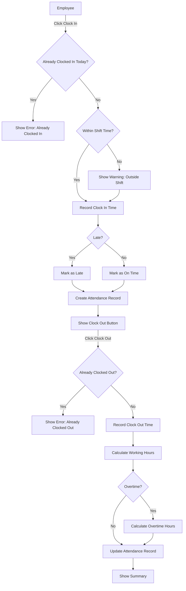
```mermaid
flowchart TD
    A[Employee] -->|Click Clock In| B{Already Clocked In Today?}
    B -->|Yes| C[Show Error: Already Clocked In]
    B -->|No| D{Within Shift Time?}
    D -->|No| E[Show Warning: Outside Shift]
    D -->|Yes| F[Record Clock In Time]
    E --> F
    F --> G{Late?}
    G -->|Yes| H[Mark as Late]
    G -->|No| I[Mark as On Time]
    H --> J[Create Attendance Record]
    I --> J
    J --> K[Show Clock Out Button]

    K -->|Click Clock Out| L{Already Clocked Out?}
    L -->|Yes| M[Show Error: Already Clocked Out]
    L -->|No| N[Record Clock Out Time]
    N --> O[Calculate Working Hours]
    O --> P{Overtime?}
    P -->|Yes| Q[Calculate Overtime Hours]
    P -->|No| R[Update Attendance Record]
    Q --> R
    R --> S[Show Summary]
```

### 6.2 Attendance Regularization Flow

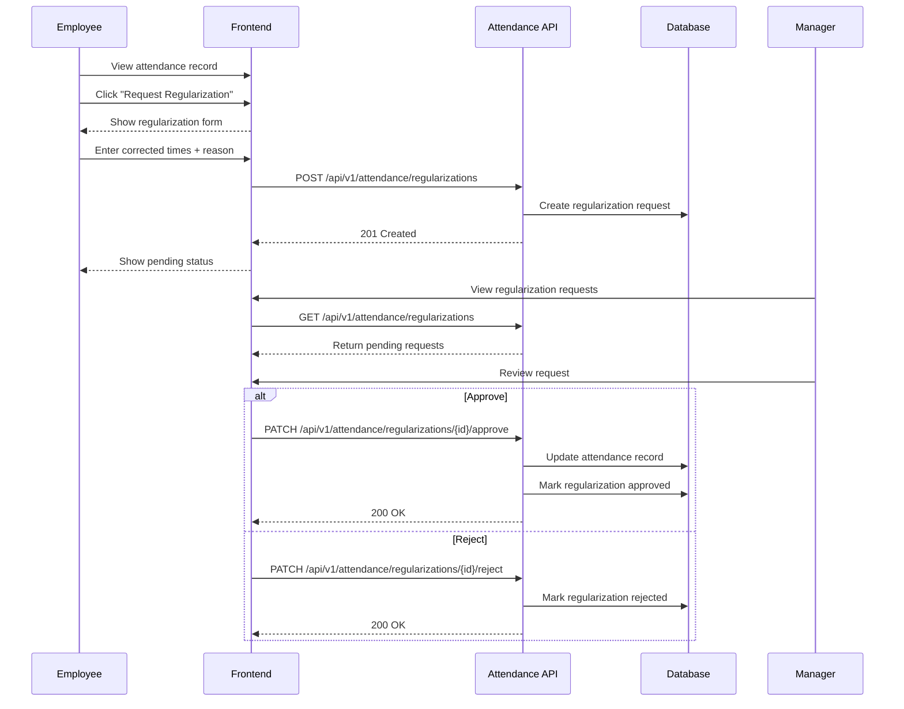
```mermaid
sequenceDiagram
    participant E as Employee
    participant F as Frontend
    participant API as Attendance API
    participant DB as Database
    participant M as Manager

    E->>F: View attendance record
    E->>F: Click "Request Regularization"
    F-->>E: Show regularization form
    E->>F: Enter corrected times + reason
    F->>API: POST /api/v1/attendance/regularizations
    API->>DB: Create regularization request
    API-->>F: 201 Created
    F-->>E: Show pending status

    M->>F: View regularization requests
    F->>API: GET /api/v1/attendance/regularizations
    API-->>F: Return pending requests
    M->>F: Review request

    alt Approve
        F->>API: PATCH /api/v1/attendance/regularizations/{id}/approve
        API->>DB: Update attendance record
        API->>DB: Mark regularization approved
        API-->>F: 200 OK
    else Reject
        F->>API: PATCH /api/v1/attendance/regularizations/{id}/reject
        API->>DB: Mark regularization rejected
        API-->>F: 200 OK
    end
```

---

## 7. Payroll Processing Workflow

### 7.1 Payroll Run Flow

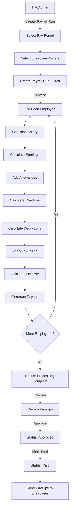
```mermaid
flowchart TD
    A[HR/Admin] -->|Create Payroll Run| B[Select Pay Period]
    B --> C[Select Employees/Filters]
    C --> D[Create Payroll Run - Draft]
    D -->|Process| E[For Each Employee]
    
    E --> F[Get Base Salary]
    F --> G[Calculate Earnings]
    G --> H[Add Allowances]
    H --> I[Calculate Overtime]
    I --> J[Calculate Deductions]
    J --> K[Apply Tax Rules]
    K --> L[Calculate Net Pay]
    L --> M[Generate Payslip]
    M --> N{More Employees?}
    N -->|Yes| E
    N -->|No| O[Status: Processing Complete]
    
    O -->|Review| P[Review Payslips]
    P -->|Approve| Q[Status: Approved]
    Q -->|Mark Paid| R[Status: Paid]
    R --> S[Send Payslips to Employees]
```

### 7.2 Payslip Generation Sequence

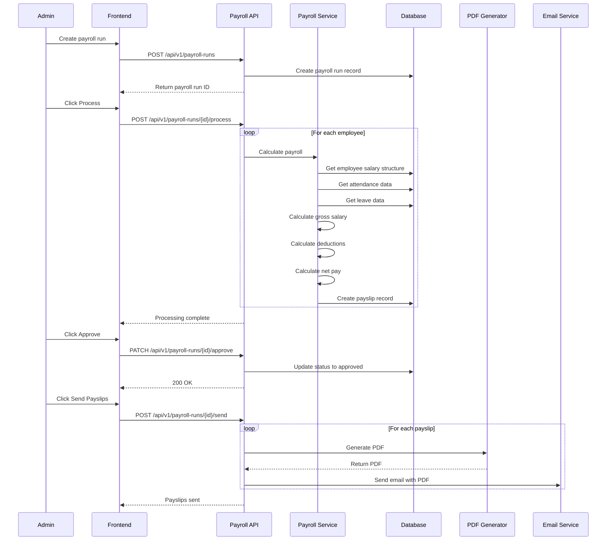
```mermaid
sequenceDiagram
    participant A as Admin
    participant F as Frontend
    participant API as Payroll API
    participant PS as Payroll Service
    participant DB as Database
    participant PDF as PDF Generator
    participant E as Email Service

    A->>F: Create payroll run
    F->>API: POST /api/v1/payroll-runs
    API->>DB: Create payroll run record
    API-->>F: Return payroll run ID

    A->>F: Click Process
    F->>API: POST /api/v1/payroll-runs/{id}/process
    
    loop For each employee
        API->>PS: Calculate payroll
        PS->>DB: Get employee salary structure
        PS->>DB: Get attendance data
        PS->>DB: Get leave data
        PS->>PS: Calculate gross salary
        PS->>PS: Calculate deductions
        PS->>PS: Calculate net pay
        PS->>DB: Create payslip record
    end
    
    API-->>F: Processing complete

    A->>F: Click Approve
    F->>API: PATCH /api/v1/payroll-runs/{id}/approve
    API->>DB: Update status to approved
    API-->>F: 200 OK

    A->>F: Click Send Payslips
    F->>API: POST /api/v1/payroll-runs/{id}/send
    
    loop For each payslip
        API->>PDF: Generate PDF
        PDF-->>API: Return PDF
        API->>E: Send email with PDF
    end
    
    API-->>F: Payslips sent
```

### 7.3 Salary Calculation Formula

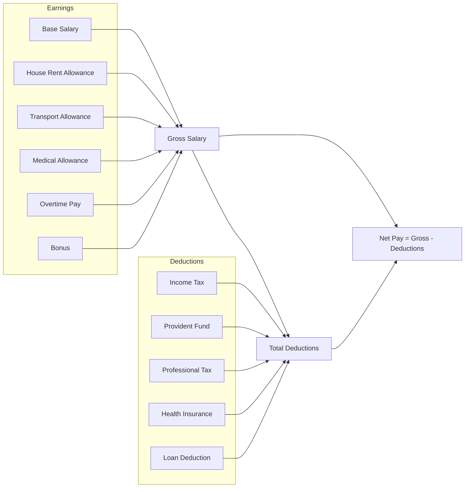
```mermaid
flowchart LR
    subgraph Earnings
        BS[Base Salary]
        HRA[House Rent Allowance]
        TA[Transport Allowance]
        MA[Medical Allowance]
        OT[Overtime Pay]
        BON[Bonus]
    end

    subgraph Deductions
        IT[Income Tax]
        PF[Provident Fund]
        PT[Professional Tax]
        HI[Health Insurance]
        LD[Loan Deduction]
    end

    BS --> GS[Gross Salary]
    HRA --> GS
    TA --> GS
    MA --> GS
    OT --> GS
    BON --> GS

    GS --> TD[Total Deductions]
    IT --> TD
    PF --> TD
    PT --> TD
    HI --> TD
    LD --> TD

    GS --> NP[Net Pay = Gross - Deductions]
    TD --> NP
```

---

## 8. Recruitment Pipeline

### 8.1 Candidate Journey

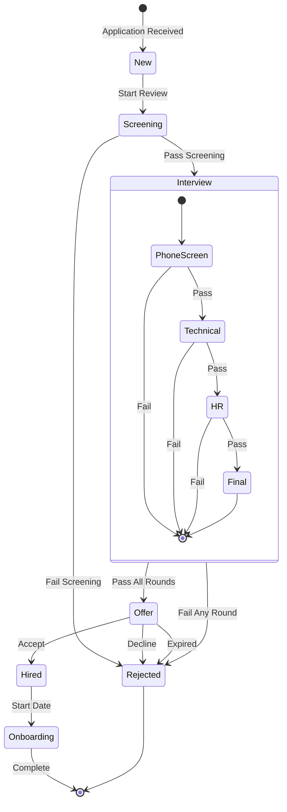
```mermaid
stateDiagram-v2
    [*] --> New: Application Received
    New --> Screening: Start Review
    Screening --> Interview: Pass Screening
    Screening --> Rejected: Fail Screening
    
    state Interview {
        [*] --> PhoneScreen
        PhoneScreen --> Technical: Pass
        PhoneScreen --> [*]: Fail
        Technical --> HR: Pass
        Technical --> [*]: Fail
        HR --> Final: Pass
        HR --> [*]: Fail
        Final --> [*]
    }
    
    Interview --> Offer: Pass All Rounds
    Interview --> Rejected: Fail Any Round
    Offer --> Hired: Accept
    Offer --> Rejected: Decline
    Offer --> Rejected: Expired
    Hired --> Onboarding: Start Date
    Onboarding --> [*]: Complete
    Rejected --> [*]
```

### 8.2 Interview Scheduling Flow

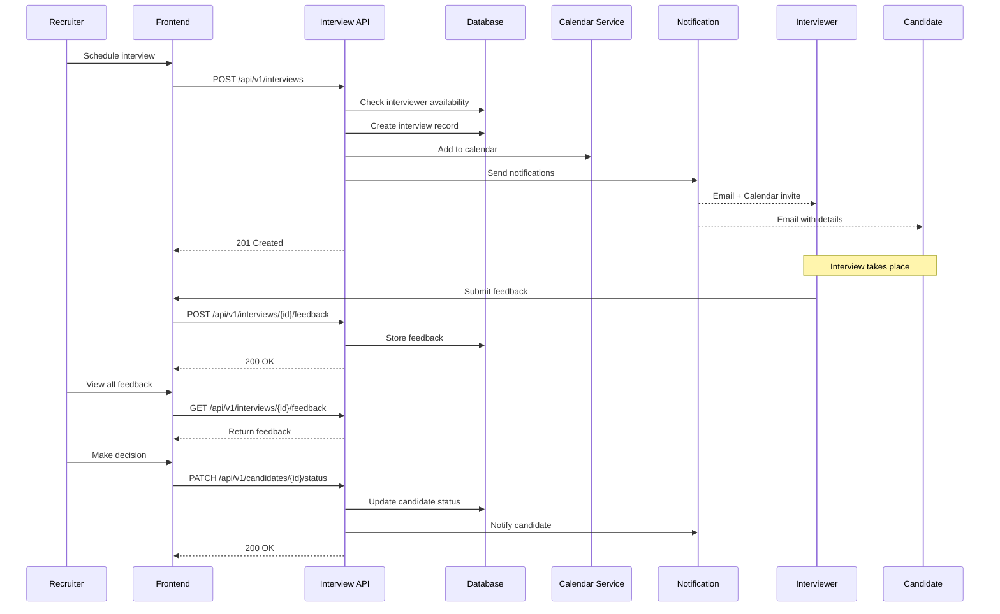
```mermaid
sequenceDiagram
    participant R as Recruiter
    participant F as Frontend
    participant API as Interview API
    participant DB as Database
    participant C as Calendar Service
    participant N as Notification
    participant I as Interviewer
    participant Ca as Candidate

    R->>F: Schedule interview
    F->>API: POST /api/v1/interviews
    API->>DB: Check interviewer availability
    API->>DB: Create interview record
    API->>C: Add to calendar
    API->>N: Send notifications
    N-->>I: Email + Calendar invite
    N-->>Ca: Email with details
    API-->>F: 201 Created

    Note over I,Ca: Interview takes place

    I->>F: Submit feedback
    F->>API: POST /api/v1/interviews/{id}/feedback
    API->>DB: Store feedback
    API-->>F: 200 OK

    R->>F: View all feedback
    F->>API: GET /api/v1/interviews/{id}/feedback
    API-->>F: Return feedback
    R->>F: Make decision
    F->>API: PATCH /api/v1/candidates/{id}/status
    API->>DB: Update candidate status
    API->>N: Notify candidate
    API-->>F: 200 OK
```

### 8.3 Offer Management Flow

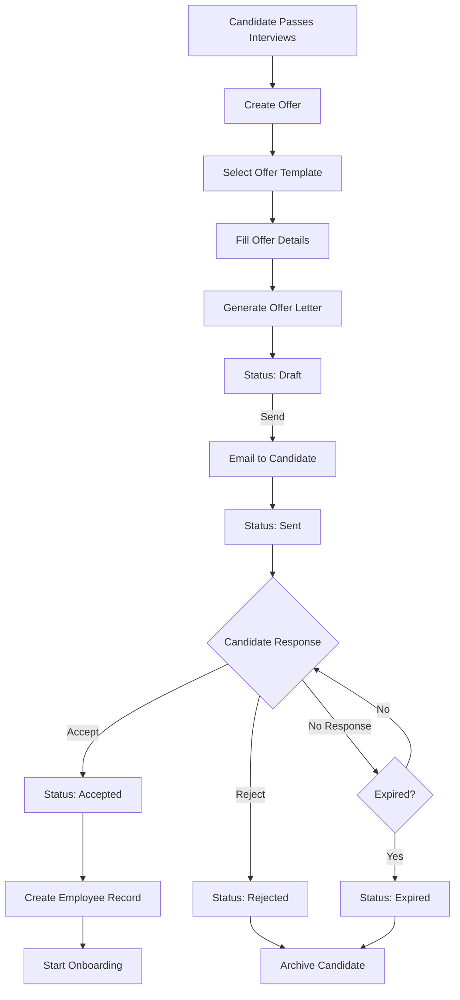
```mermaid
flowchart TD
    A[Candidate Passes Interviews] --> B[Create Offer]
    B --> C[Select Offer Template]
    C --> D[Fill Offer Details]
    D --> E[Generate Offer Letter]
    E --> F[Status: Draft]
    F -->|Send| G[Email to Candidate]
    G --> H[Status: Sent]
    H --> I{Candidate Response}
    I -->|Accept| J[Status: Accepted]
    I -->|Reject| K[Status: Rejected]
    I -->|No Response| L{Expired?}
    L -->|Yes| M[Status: Expired]
    L -->|No| I
    J --> N[Create Employee Record]
    N --> O[Start Onboarding]
    K --> P[Archive Candidate]
    M --> P
```

---

## 9. Performance Review Workflow

### 9.1 Review Cycle Flow

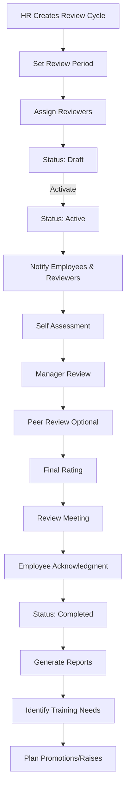
```mermaid
flowchart TD
    A[HR Creates Review Cycle] --> B[Set Review Period]
    B --> C[Assign Reviewers]
    C --> D[Status: Draft]
    D -->|Activate| E[Status: Active]
    E --> F[Notify Employees & Reviewers]
    
    F --> G[Self Assessment]
    G --> H[Manager Review]
    H --> I[Peer Review Optional]
    I --> J[Final Rating]
    J --> K[Review Meeting]
    K --> L[Employee Acknowledgment]
    L --> M[Status: Completed]
    
    M --> N[Generate Reports]
    N --> O[Identify Training Needs]
    O --> P[Plan Promotions/Raises]
```

### 9.2 Goal Setting and Tracking

```mermaid
sequenceDiagram
    participant M as Manager
    participant E as Employee
    participant F as Frontend
    participant API as Goals API
    participant DB as Database

    M->>F: Create goal for employee
    F->>API: POST /api/v1/employee-goals
    API->>DB: Create goal record
    API-->>F: 201 Created
    F-->>E: Notification: New goal assigned

    loop Progress Updates
        E->>F: Update goal progress
        F->>API: PUT /api/v1/employee-goals/{id}
        API->>DB: Update progress
        API-->>F: 200 OK
    end

    E->>F: Mark goal complete
    F->>API: PATCH /api/v1/employee-goals/{id}/complete
    API->>DB: Update status
    API-->>F: 200 OK
    F-->>M: Notification: Goal completed

    M->>F: Review and verify
    F->>API: PATCH /api/v1/employee-goals/{id}/verify
    API->>DB: Mark as verified
    API-->>F: 200 OK
```

---

## 10. Contract Management Workflow

### 10.1 Contract Lifecycle

```mermaid
stateDiagram-v2
    [*] --> Draft: Create Contract
    Draft --> Active: Sign & Activate
    Active --> Renewal: Approaching Expiry
    Renewal --> Active: Renewed
    Renewal --> Expired: Not Renewed
    Active --> Terminated: Early Termination
    Active --> Expired: End Date Reached
    Terminated --> [*]
    Expired --> [*]
```

### 10.2 Contract Renewal Flow

```mermaid
flowchart TD
    A[System Check] -->|30 Days Before Expiry| B[Send Renewal Reminder]
    B --> C[HR Reviews Contract]
    C --> D{Renew?}
    D -->|Yes| E[Create Renewal Record]
    E --> F[Update Contract Terms]
    F --> G[Adjust Salary if needed]
    G --> H[Generate New Contract]
    H --> I[Employee Signs]
    I --> J[Activate New Contract]
    J --> K[Archive Old Contract]
    D -->|No| L[Initiate Exit Process]
    L --> M[Contract Expires]
```

---

## 11. Document Acknowledgment Workflow

```mermaid
sequenceDiagram
    participant HR as HR Admin
    participant F as Frontend
    participant API as Document API
    participant DB as Database
    participant N as Notification
    participant E as Employee

    HR->>F: Upload document
    F->>API: POST /api/v1/documents
    API->>DB: Store document
    API-->>F: 201 Created

    HR->>F: Set acknowledgment required
    HR->>F: Select target employees
    F->>API: PUT /api/v1/documents/{id}
    API->>DB: Update document settings
    API->>N: Send notifications
    N-->>E: Email: New document requires acknowledgment
    API-->>F: 200 OK

    E->>F: View document
    F->>API: GET /api/v1/documents/{id}
    API-->>F: Return document
    E->>F: Click Acknowledge
    F->>API: POST /api/v1/documents/{id}/acknowledge
    API->>DB: Record acknowledgment
    API-->>F: 200 OK

    HR->>F: View acknowledgment status
    F->>API: GET /api/v1/documents/{id}/acknowledgments
    API-->>F: Return acknowledgment list
```

---

## 12. Meeting Management Workflow

### 12.1 Meeting Scheduling Flow

```mermaid
flowchart TD
    A[Organizer] -->|Schedule Meeting| B[Select Date/Time]
    B --> C[Check Room Availability]
    C --> D{Room Available?}
    D -->|No| E[Select Different Room/Time]
    E --> C
    D -->|Yes| F[Add Attendees]
    F --> G[Set Agenda]
    G --> H[Create Meeting]
    H --> I[Send Invitations]
    I --> J[Add to Calendar]
    J --> K[Status: Scheduled]
    
    K -->|Meeting Time| L[Status: In Progress]
    L --> M[Record Minutes]
    M --> N[Create Action Items]
    N --> O[Status: Completed]
    O --> P[Send Minutes to Attendees]
```

### 12.2 Action Item Tracking

```mermaid
sequenceDiagram
    participant O as Organizer
    participant F as Frontend
    participant API as Meeting API
    participant DB as Database
    participant N as Notification
    participant A as Assignee

    O->>F: Create action item
    F->>API: POST /api/v1/meetings/{id}/action-items
    API->>DB: Create action item
    API->>N: Notify assignee
    N-->>A: Email: New action item assigned
    API-->>F: 201 Created

    A->>F: View action items
    F->>API: GET /api/v1/action-items?assigned_to=me
    API-->>F: Return action items

    A->>F: Update progress
    F->>API: PUT /api/v1/action-items/{id}
    API->>DB: Update status
    API-->>F: 200 OK

    A->>F: Mark complete
    F->>API: PATCH /api/v1/action-items/{id}/complete
    API->>DB: Update status to completed
    API->>N: Notify organizer
    API-->>F: 200 OK
```

---

## 13. Training Management Workflow

```mermaid
flowchart TD
    A[HR Creates Training Program] --> B[Define Sessions]
    B --> C[Set Schedule]
    C --> D[Publish Program]
    D --> E[Employees Enroll/Assigned]
    E --> F[Session Starts]
    F --> G[Track Attendance]
    G --> H[Session Ends]
    H --> I{Assessment?}
    I -->|Yes| J[Conduct Assessment]
    J --> K[Record Scores]
    I -->|No| L[Mark Attendance]
    K --> L
    L --> M{More Sessions?}
    M -->|Yes| F
    M -->|No| N[Program Complete]
    N --> O[Issue Certificates]
    O --> P[Update Employee Records]
```

---

## 14. Asset Management Workflow

### 14.1 Asset Lifecycle

```mermaid
stateDiagram-v2
    [*] --> Procured: Purchase Asset
    Procured --> Available: Add to Inventory
    Available --> Assigned: Assign to Employee
    Assigned --> Available: Return/Unassign
    Assigned --> Maintenance: Needs Repair
    Maintenance --> Available: Repaired
    Maintenance --> Retired: Beyond Repair
    Available --> Retired: End of Life
    Retired --> Disposed: Disposal
    Disposed --> [*]
```

### 14.2 Asset Assignment Flow

```mermaid
sequenceDiagram
    participant A as Admin
    participant F as Frontend
    participant API as Asset API
    participant DB as Database
    participant N as Notification
    participant E as Employee

    A->>F: Select asset to assign
    F->>API: GET /api/v1/assets/{id}
    API-->>F: Return asset details

    A->>F: Select employee
    A->>F: Set assignment details
    F->>API: POST /api/v1/assets/{id}/assign
    API->>DB: Create assignment record
    API->>DB: Update asset status
    API->>N: Notify employee
    N-->>E: Email: Asset assigned to you
    API-->>F: 200 OK

    Note over E: Employee uses asset

    A->>F: Unassign asset
    F->>API: POST /api/v1/assets/{id}/unassign
    API->>DB: Close assignment record
    API->>DB: Update asset status to available
    API->>N: Notify employee
    API-->>F: 200 OK
```

---

## 15. Complaint Resolution Workflow

```mermaid
flowchart TD
    A[Employee Files Complaint] --> B[Status: Open]
    B --> C[HR Receives Notification]
    C --> D[HR Reviews Complaint]
    D --> E{Valid Complaint?}
    E -->|No| F[Status: Dismissed]
    F --> G[Notify Complainant]
    E -->|Yes| H[Assign Investigator]
    H --> I[Status: In Progress]
    I --> J[Investigation]
    J --> K[Gather Evidence]
    K --> L[Interview Parties]
    L --> M[Prepare Report]
    M --> N[HR Reviews Findings]
    N --> O[Take Action]
    O --> P[Status: Resolved]
    P --> Q[Notify All Parties]
    Q --> R[Close Complaint]
```

---

## 16. Transfer Workflow

```mermaid
sequenceDiagram
    participant M as Manager
    participant F as Frontend
    participant API as Transfer API
    participant DB as Database
    participant N as Notification
    participant HR as HR Admin
    participant E as Employee

    M->>F: Initiate transfer request
    F->>API: POST /api/v1/transfers
    API->>DB: Create transfer record
    API->>N: Notify HR
    N-->>HR: Email: Transfer request pending
    API-->>F: 201 Created

    HR->>F: Review transfer
    F->>API: GET /api/v1/transfers/{id}
    API-->>F: Return transfer details

    alt Approve
        HR->>F: Approve transfer
        F->>API: PATCH /api/v1/transfers/{id}/approve
        API->>DB: Update transfer status
        API->>DB: Update employee branch/department
        API->>N: Notify employee and managers
        N-->>E: Email: Transfer approved
        N-->>M: Email: Transfer approved
        API-->>F: 200 OK
    else Reject
        HR->>F: Reject transfer
        F->>API: PATCH /api/v1/transfers/{id}/reject
        API->>DB: Update transfer status
        API->>N: Notify requestor
        API-->>F: 200 OK
    end
```

---

## 17. Promotion Workflow

```mermaid
flowchart TD
    A[Manager Recommends Promotion] --> B[Create Promotion Request]
    B --> C[Status: Pending]
    C --> D[HR Reviews]
    D --> E{Budget Available?}
    E -->|No| F[Status: On Hold]
    F --> G[Wait for Budget]
    G --> D
    E -->|Yes| H{Meets Criteria?}
    H -->|No| I[Status: Rejected]
    I --> J[Notify Manager]
    H -->|Yes| K[Status: Approved]
    K --> L[Update Employee Designation]
    L --> M[Update Salary if applicable]
    M --> N[Notify Employee]
    N --> O[Update Records]
```

---

## 18. Trip Approval Workflow

```mermaid
sequenceDiagram
    participant E as Employee
    participant F as Frontend
    participant API as Trip API
    participant DB as Database
    participant N as Notification
    participant M as Manager
    participant FIN as Finance

    E->>F: Submit trip request
    F->>API: POST /api/v1/trips
    API->>DB: Create trip record
    API->>N: Notify manager
    N-->>M: Email: Trip request pending
    API-->>F: 201 Created

    M->>F: Review trip request
    
    alt Approve
        M->>F: Approve trip
        F->>API: PATCH /api/v1/trips/{id}/approve
        API->>DB: Update status
        API->>N: Notify employee
        API-->>F: 200 OK
    else Reject
        M->>F: Reject trip
        F->>API: PATCH /api/v1/trips/{id}/reject
        API->>DB: Update status
        API->>N: Notify employee
        API-->>F: 200 OK
    end

    Note over E: Trip takes place

    E->>F: Submit expenses
    F->>API: POST /api/v1/trips/{id}/expenses
    API->>DB: Create expense records
    API-->>F: 201 Created

    E->>F: Complete trip
    F->>API: PATCH /api/v1/trips/{id}/complete
    API->>DB: Update status
    API->>N: Notify finance
    N-->>FIN: Email: Trip expenses for review
    API-->>F: 200 OK

    FIN->>F: Review and reimburse
    F->>API: PATCH /api/v1/trips/{id}/reimburse
    API->>DB: Mark as reimbursed
    API->>N: Notify employee
    API-->>F: 200 OK
```

---

## Entity Relationship Overview

```mermaid
erDiagram
    COMPANY ||--o{ BRANCH : has
    BRANCH ||--o{ DEPARTMENT : has
    DEPARTMENT ||--o{ DESIGNATION : has
    DEPARTMENT ||--o{ EMPLOYEE : belongs_to
    DESIGNATION ||--o{ EMPLOYEE : has
    
    USER ||--|| EMPLOYEE : is
    USER }o--o{ ROLE : has
    ROLE }o--o{ PERMISSION : has
    
    EMPLOYEE ||--o{ LEAVE_APPLICATION : submits
    EMPLOYEE ||--o{ ATTENDANCE_RECORD : has
    EMPLOYEE ||--o{ PAYSLIP : receives
    EMPLOYEE ||--o{ CONTRACT : has
    EMPLOYEE ||--o{ AWARD : receives
    EMPLOYEE ||--o{ TRAINING : attends
    
    LEAVE_TYPE ||--o{ LEAVE_APPLICATION : categorizes
    LEAVE_TYPE ||--o{ LEAVE_BALANCE : defines
    
    SHIFT ||--o{ EMPLOYEE : assigned_to
    SHIFT ||--o{ ATTENDANCE_RECORD : defines
    
    JOB_POSTING ||--o{ CANDIDATE : attracts
    CANDIDATE ||--o{ INTERVIEW : has
    CANDIDATE ||--o{ OFFER : receives
    
    MEETING ||--o{ MEETING_ATTENDEE : has
    MEETING ||--o{ MEETING_MINUTES : has
    MEETING ||--o{ ACTION_ITEM : generates
    
    PAYROLL_RUN ||--o{ PAYSLIP : generates
    SALARY_COMPONENT ||--o{ EMPLOYEE_SALARY : includes
```

---

## Data Flow Overview

```mermaid
flowchart LR
    subgraph Input
        UI[User Interface]
        API_EXT[External APIs]
        Import[Data Import]
    end

    subgraph Processing
        Auth[Authentication]
        Valid[Validation]
        BL[Business Logic]
        Calc[Calculations]
    end

    subgraph Storage
        DB[(Database)]
        Files[(File Storage)]
        Cache[(Cache)]
    end

    subgraph Output
        Response[API Response]
        Email[Email Notifications]
        PDF[PDF Generation]
        Export[Data Export]
    end

    UI --> Auth
    API_EXT --> Auth
    Import --> Valid
    Auth --> Valid
    Valid --> BL
    BL --> Calc
    Calc --> DB
    BL --> Files
    BL --> Cache
    DB --> Response
    BL --> Email
    BL --> PDF
    DB --> Export
```

---

## Summary

This document provides comprehensive workflow diagrams for all major processes in the WorkDo HRM system. These diagrams can be used for:

1. **Development Reference** - Understanding how features should be implemented
2. **Testing** - Creating test cases based on workflow paths
3. **Documentation** - User guides and training materials
4. **Troubleshooting** - Identifying where issues might occur in a process
5. **Optimization** - Finding bottlenecks and improvement opportunities

All diagrams are in Mermaid format and can be rendered in any Mermaid-compatible viewer or documentation system.
